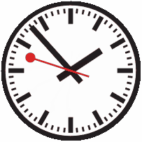

# MondaineClock
A simple desktop clock widget inspired by the original Swiss Mondaine Railway design.

### Running:
Download `MondaineClock.exe` and double-click it to start it.  
You can pass in the following additional parameters to control the behavior:  
	- `size value` (controls the size of the clock)  
	- `posx value` (controls the start X position)  
	- `posy value` (controls the start Y position)  
	- `stop2go` (adds the stop2go behavior, with the seconds hand briefly waiting at 00)  

For example, use `MondaineClock.exe size 200 posx 10 posy 10 stop2go` on the commandline.

### Building:
You need to change `sfml` and `extralibs` in `Variables.props` to point to the correct location on your system.  
Then build `MondaineClock.sln`. The required libraries are statically built, so at the end you can just open `<Config>\MondaineClock.exe`.  